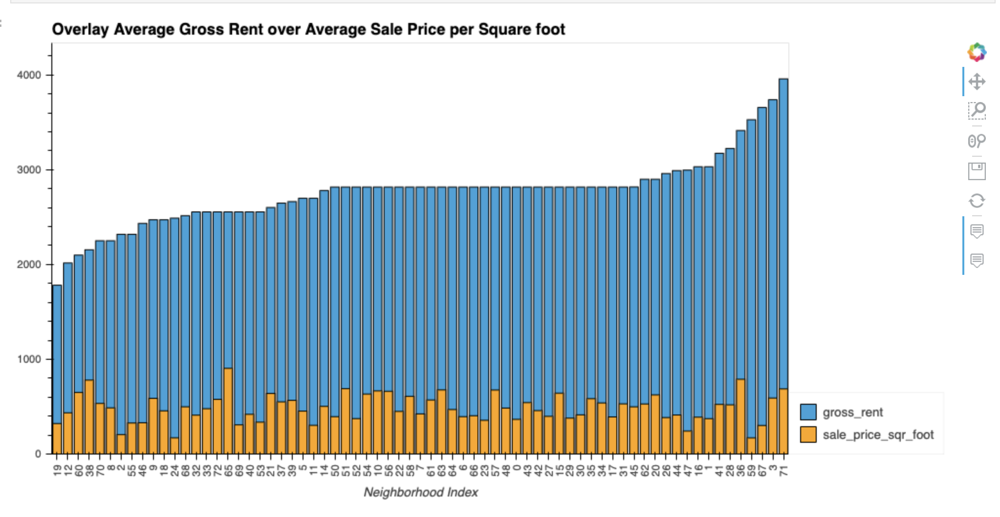

# Housing Rental Analysis for San Francisco
We are an analysts that want to offer an instant, one-click service for people to buy properties and then rent them. First, we want to trial of this offering in the San Francisco real-estate market. If the service proves popular, we can then expand to other markets. Our job is to use our data [visualization skills](https://hvplot.holoviz.org/ "hvPlot"), including [aggregation](https://jakevdp.github.io/PythonDataScienceHandbook/03.08-aggregation-and-grouping.html), interactive visualizations, and [geospatial analysis](https://geoviews.org/), to find properties in the San Francisco market that are viable investment opportunities.

## Technologies
Housing Rental Analysis for San Francisco project leverages python 3.7 with the following packages:

[Pandas](https://github.com/pandas-dev/pandas "Pandas") 


## Installation Guide

First install the following libraries and dependencies.

```
# conda
conda install pandas
conda install -c pyviz hvplot geoviews
```

```
import pandas as pd
import hvplot.pandas
from pathlib import Path
```

## Usage


**Calculate and Plot the Housing Units per Year**

>First part of the assignment, is to use numerical and visual aggregation to calculate the number of housing units per year, and then visualize the results as a bar char.


**Calculate and Plot the Average Sale Prices per Square Foot**

>Next we will use numerical and visual aggregation to calculate the average prices per square foot, hvplot then visualize the results as a bar chart. 


**Compare the Average Sale Prices by Neighborhood**

>Now we can use interactive visualizations and interactive widgets to explore the average sale price per square foot by neighborhood.


**Build an Interactive Neighborhood Map**

>Last part is to explore the geospatial relationships in the data by using interactive visualizations with hvPlot and GeoViews. 


**Compose Your Data Story**

>We can create an overlay hvplot to better compare and visualize trends in rental income vs trends in sale prices.



## Contributors

* Brought to you by Olga Koryachek.
* Email: olgakoryachek@live.com
* [LinkedIn](https://www.linkedin.com/in/olga-koryachek-a74b1877/?msgOverlay=true "LinkedIn")


---

## License

Licensed under the [MIT License](https://choosealicense.com/licenses/mit/)


